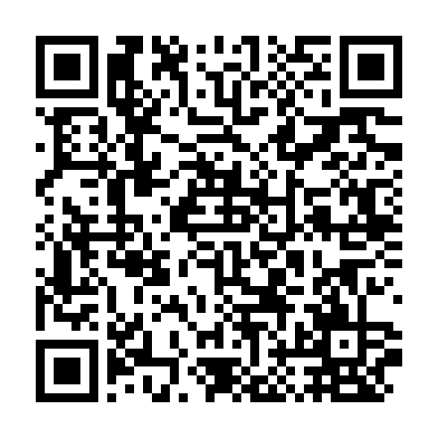

# Vita Radio

An internet radio player for the PlayStation Vita. Browse 90 built-in stations
or search for your own, press X, and it streams — MP3, AAC and HLS over HTTP
and HTTPS, with the ICY track title shown while it plays. Written in C with
VitaSDK and vita2d.

## Features

- **90 built-in stations**, including 30 BBC networks, grouped by region and
  genre, with the codec and stream type shown per station.
- **HLS** as well as plain MP3 and AAC: master and media playlists, MPEG-TS and
  raw ADTS segments, and AES-128 encrypted segments.
- **Playlist links work** — point it at a `.pls` or `.m3u` and it follows the
  link to the actual stream.
- **Four tabs** — Stations, Favourites, Search and System — cycled with L/R.
- **Filter chips** on the Stations tab: Built-in, Popular, Rock, Jazz, News,
  Classical, Dance, UK and US, pulled live from the radio-browser.info
  directory.
- **Four colour themes** — Midnight, Deep blue, True black and Graphite —
  picked in System → Theme and remembered between sessions.
- **Search** the radio-browser.info directory from the console (SQUARE) using
  the Vita's on-screen keyboard.
- **Favourites** (TRIANGLE), saved between sessions and starred wherever the
  station appears.
- **Live stream info:** state, ICY track title, codec, sample rate, channels,
  HTTP status, buffer fill and bytes received.
- **HTTPS streams** with certificate verification against a bundled CA store.
- **Fast station switching** — starting a new station never waits on the old
  one's socket to close.
- **Built-in updater** on the System tab: downloads and installs the latest
  GitHub release with a progress bar, then restarts itself.

## Install



Scan the code with the Vita's own browser (**Browser → ☰ → QR code reader**) and
it downloads `VitaRadio.vpk` for 3.0.0 straight to the console — no PC, no USB.
Then install the downloaded file with VitaShell.

Or do it by hand:

1. Download `VitaRadio.vpk` from the
   [latest release](https://github.com/stevenjc2009-byte/vita-radio/releases/latest).
2. Copy it to your Vita and install it with VitaShell.
3. Enable **Unsafe Homebrew** in HENkaku Settings — the built-in updater needs
   it to install the package it downloads.

From 1.0.0 onwards you only have to do this once: later versions arrive through
the **System** tab's *Check for updates* row inside the app.

## Controls

| Button | Action |
| --- | --- |
| L / R | Switch tab: Stations, Favourites, Search, System |
| Up / Down | Move through the list, or between System rows (hold to repeat) |
| Left / Right | Pick a filter chip (Stations), or change the value (System) |
| X | Play the selected station, or activate the System row |
| O | Stop playback |
| TRIANGLE | Add or remove the selected station from Favourites |
| SQUARE | Search for stations (opens the on-screen keyboard) |
| SELECT | Jump straight to the System tab |
| START | Quit |

Moving onto a filter chip fetches it straight away, so Left/Right on the
Stations tab is a network request each press.

## Building (WSL + VitaSDK)

```bash
export VITASDK=$HOME/vitasdk   # wherever your VitaSDK lives
make                      # -> build-mbedtls/VitaRadio.vpk
make TLS=openssl          # -> build-openssl/VitaRadio.vpk
make BUILD=build-verify   # build into a separate directory
```

The object directory defaults to `build-$(TLS)`, so the two TLS backends never
share objects — they compile against different curl headers (vendored 8.22.0
for mbedTLS, the SDK's 8.17.0 for OpenSSL) and nothing in the dependency graph
can see that change, so a shared directory would silently link the wrong ones.
`make clean` removes the current backend's directory only.

The build runs with `-Werror`; it is warning-clean on
`arm-vita-eabi-gcc` 15.2.0.

17 host unit test suites cover the pure-C modules — ring buffer, ICY parser,
format sniffer, player lifecycle, `.pls`/`.m3u` playlists, URL resolution, the
HLS stack (M3U8 parser, MPEG-TS demuxer, ADTS scanner, AES-128 and key
handling), the station list and favourites, version/JSON parsing, SHA-1 +
head.bin and the zip extractor. They build outside the SDK, under ASan and
UBSan:

```bash
make -C tests                          # build + run all 17 suites
make -C tests BUILD=build-host-x       # separate object dir (parallel runs)
```

The run is gated so it cannot pass by doing less work than it should:

- **Suite count.** `EXPECT_TESTS` in `tests/Makefile` pins the number of
  `test_*.c` files at 17. A deleted or renamed suite fails the run instead of
  quietly shrinking it. **Bump `EXPECT_TESTS` when you add a suite.**
- **Sanitizer findings are fatal.** `-fno-sanitize-recover=all` means a UBSan
  finding aborts the suite. Without it UBSan only prints `runtime error: …` and
  the suite still exits 0, so undefined behaviour was reported as "0 failed".
- **Per-test timeout.** Each suite gets `TEST_TIMEOUT` (300s) — long enough for
  `test_ringbuf`'s two-thread 8 MB stress test under ASan. A timeout is counted
  as a failure, so a deadlocked suite fails the run rather than hanging it.

## Credits

- The fake-PKG header template `assets/head.bin` is the one used by VitaShell,
  VHBB and VitaDB Downloader, from
  [VitaShell](https://github.com/TheOfficialFloW/VitaShell) (GPL-3.0).
- `assets/cacert.pem` is the Mozilla CA certificate bundle as distributed by
  [curl](https://curl.se/docs/caextract.html).
- Built on [VitaSDK](https://vitasdk.org), [vita2d](https://github.com/xerpi/libvita2d),
  [FFmpeg](https://ffmpeg.org), [curl](https://curl.se), [mbedTLS](https://www.trustedfirmware.org/projects/mbed-tls/)
  and [zlib](https://zlib.net).

## License

GPL-3.0. See [LICENSE](LICENSE).
